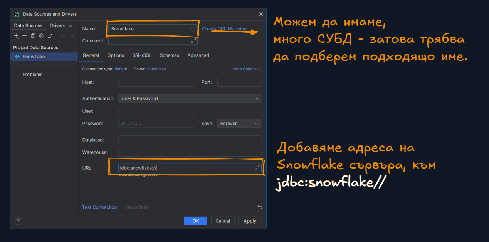

# Има ли вариант да ползваме локален редактор ?

Понякога WEB интерфейса не е нашето нещо - и някак си не ни допада визуално. В такива случай най-доброто решение е да се свържем към Snowflake инфраструктурата на нашия акаунт и да ползваме локален текстов редактор за изпълнението на заявките. Въпроса за избор на текстов редактор е стар колкото света. Съществуват различни решения, под формата на плъгини за достъп до Snowflake. 

Аз лично съм привърженик на редактора - [DataGrip](https://www.jetbrains.com/datagrip)  , затова голяма част от примемерите ще виждате именно него. Но разбира се чувствайте се свободни да ползвате инструмента, който най-много подхожда на вашия стил на работа.

## Инсталация на DataGrip

И все пак ако сте фенове на JetBrains продуктите и искате да се придържате стриктно към обучениет, ви предлагам да свалим и инсталираме заедно DataGrip. На кратко това е инструмент за мониторинг на системи за управление на бази данни и облачни платформи, агрегатори от данни и системи за мащабиране на информационни процеси. 

Редактора поддържа огромно количество популярни продукти, като предлага унифициран интерфейс и процес, което го прави идеален за хора, които ползват няколко системи едновременно или правят миграция. Лично на мен ми допада интерфейса и огромната работа, която са свършили хората от JetBrains в направление, използваемост на продукта. 

Така че нека да си го свалим, от [офицялния сайт](http://jetbrains.com/datagrip), на продукта. 

Инсталацията е достатъчно проста за да преминете през нея без главоболия. Единственото нещо, което бих ви посъветвал е да асоциирате проектите ви с редактора, като изберете от опциите всички чекбоксове, с изключение на иконката на Desktop - a, тя е опционална.

След няколко секунди вече ще сте горд ползвател на DataGrip и можем да направим опит да се свържем към Snowflake акаунта ни.

## Създаваме нов DataGrip проект

Всеки пък, когато работите с една или набор от информационни системи, трябва да създавате така наречения проукт, който условно представлява папка която организира всичките ви връзки, сорс код локации и конфигурации на текущите акаунти. Ако вече имате подготвена организационна структура от предишни проекти свалете от Git или отворете от локалната ви машина. 

Изберете име на проекта, което да не ви хвърля в размисли. Силно препоръчвам да избягвате имена които съдържат само абривиатури или пък са инспирирани от моментното ни желание просто да стартираме проекта. Ще има много да се чудите, какво ли съдържа проекта **test** или **ddd - след около две седмици на неактивност.**  

**Понеже този проект, който правим в момента има за цел само и единствено да ни запознае с връзката към Snowflake с цел преизползване след време аз ще го кръстя банално SnowflakeConnect.**

## Връзка към Snowflake акаунт

След иницииране на проект - обикновенно ни посреща черния екран на смъртта в очакване нещо да се случи. Първата ни задача е да установим връзка към системата, от която ще четем и изпращаме данни. Нсочете погледа си към менюто **Create data source,** в левия страничен панел и изберете първата опция **Data Source.**

Списъка с възможните платформи и продукти е впечатляващ - откриите с поглед Snowflake в дъното на списъка и го изберете. Ако в даден момент имате нужда от няколко платформи, просто трябва да повторите процеса, същото важи и за няколко Snowflake акаунта, които да ползвате паралелно.

Ще се наложи да се върнем, в Web интерфейса на Snowflake за да копираме адреса на нашата инстанция. Можете да забележите в URL адреса, на вашия акаунт набор от странни буквички, които описват уникалния идентификатор на вашия акунт. Най-лесния начин да го вземете е като - кликневе върху вашия акаунт в долния ляв ъгъл на интерфейса и изберете. **Connect a tool to Snowflake.**

Това е тайното място в което можете да откриете огромно количество системна информация, за вашия акаунт, както и начина по който да се свържете съм различни инструменти и езици за програмиране. 

Насочете погледа си към полето **Account/Server URL и копирайте адреса.** 

Отново се връщаме в DataGrip и насочваме погледа си към полето URL в долната част на модалния прозорец. Можете да видите че първоначално DataGrip добавя низа **jdbc:snowflake//. Текстовия редактор използва технологията Java Database Connector (JDBC) за да осъществи връзка към базата данни, като за тази цел е необходимо да добавим този специален протокол JDBC и името на базата данни към която правим връзката.**

Крайния резултат в URL е комбинация от ПРОТОКОЛА:БАЗАТА ДАННИ // АДРЕСА НА СЪРВЪРА. Можете да добавяти и допълнителни конфигурационни параметри като:

- потребителско име
- парола
- база данни или схема, към която ще се свържем

В нашия случай трябва да добавим потербителя и паролата - за да осъществим връзка към сървъра, но останалите данни са опционални. Както може би допускате можем да си направим множество връзки към Snowflake акаунта, в които специфицираме конкретни бази данни, схеми или Warehouse - ве.

След като успешно установим връзка с нашия акаунт, вече можем да изпълняваме всички си заявки директно през редактора за SQL код. Разбира се част от спезифичните функционалностите на Snowflake като:

- управление на бюджета
- достъп до Marketplace
- администриране на AI и ML модели

няма как да бъдат достъпени през текстовия редактор, но всички ежедневни задачи, които предполагат компилация на код, могат спокойно да се изпълняват през познат и доста функционален локален инструмент. Избора е ваш 😎.